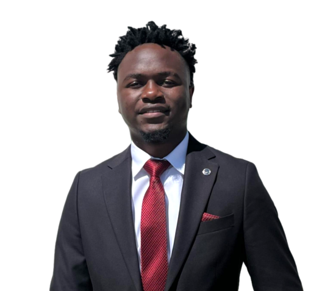

# Hi, I'm Simbarashe Dzobo 👋

  

## About Me

I'm **Simbarashe Dzobo**, a Computer Engineer and recent graduate of the **European University of Lefke**.

My interest in technology started with a curiosity about how computers work beyond what we see on the screen. That curiosity eventually led me to Computer Engineering, where I developed an interest in the relationship between **hardware, software, and intelligent systems**.

Throughout my studies, I worked on projects ranging from **microcontrollers and embedded systems to web applications and AI-based projects**. These experiences helped me develop not only technical skills, but also a stronger ability to analyse problems, troubleshoot systems, develop ideas, and turn them into working projects.

Today, I am particularly interested in **embedded systems, hardware, and autonomous technologies**, while continuing to expand my software and AI capabilities.

## My Journey

**Curiosity → Computer Engineering → Hardware & Software → Embedded Systems → Autonomous Technologies**

I am still early in my professional journey, but I am focused on continuously learning, building, and gaining real-world engineering experience.

My long-term goal is to contribute to the development of innovative autonomous technologies and eventually build systems that solve meaningful problems.

## What I Can Do

* Develop web-based applications
* Program microcontrollers using C
* Work with Arduino and ESP32
* Build hardware-software systems
* Develop applications using Python and Django
* Work with databases
* Develop AI and computer vision projects
* Analyse and troubleshoot technical problems
* Turn ideas into practical projects

## What I'm Looking For

I'm currently open to **full-time opportunities, engineering roles, internships, collaborations, and meaningful projects** where I can contribute, learn, and grow as an engineer.

If you're looking for a **Computer Engineer who enjoys learning, solving problems, working with technology, and building things**, I'd be happy to connect.

### Let's Work Together

**Hiring?** Let's talk.

**Building something?** Let's collaborate.

**Have an interesting engineering problem?** I'd like to hear about it.

---

**Simbarashe Dzobo**
Computer Engineer | Embedded Systems | Hardware & Software | Autonomous Technologies
